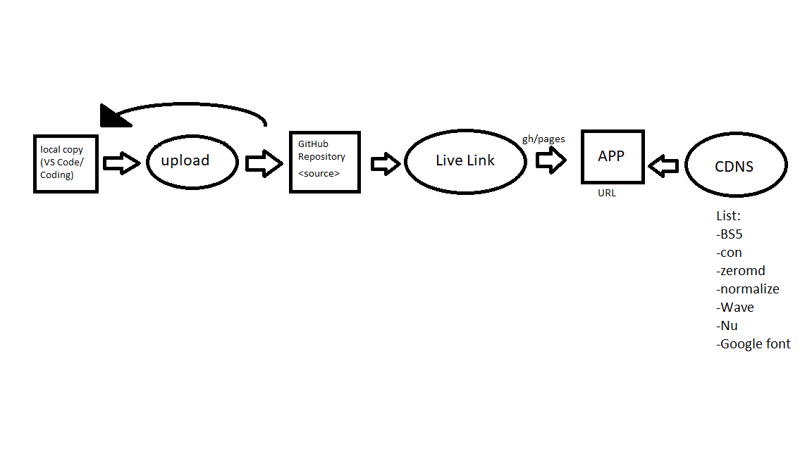

## Overview
The purpose of this document is to give an overview of what I have learned throught the semester as it pertains to the projects i've done. This will includes terms (with examples),
explanations of infrasturcture and architecht, all listed infastructure, architecture of app, and will conclude with a takeaway. Thank you for reading!

## Technical Definitions

**Fetch API**

The Fetch API is a modern JavaScript interface used in web development to make network requests—such as retrieving data from a server or sending user input to an application backend. Technically, it provides a cleaner, promise-based alternative to older tools like XMLHttpRequest, allowing developers to work with HTTP requests using simple, readable syntax. As a process, the Fetch API handles sending a request, awaiting a response, converting that response into useful data (like JSON), and managing errors. It enables smooth communication between front-end applications and remote servers, making it essential for interactive, data-driven web pages.


**RESTful API**

A RESTful API (Representational State Transfer API) is a style of designing web services where data and operations are organized around resources that can be accessed using standard HTTP methods like GET, POST, PUT, and DELETE. Technically, a RESTful API returns data in lightweight formats such as JSON or XML, and each request is stateless, meaning the server doesn’t store client session information between requests. As a process, RESTful API design emphasizes scalability, clear structure, and predictable behavior—clients request specific resources via URLs, and servers respond with representations of those resources. This makes REST one of the most widely used patterns for building modern, distributed applications.


**Information Systems Architecture**

IS architecture refers to the structured design of an organization’s information systems—covering the data, applications, processes, and technologies that support business operations. Technically, it defines how software systems interact, how data moves through the organization, and how technology components are integrated. As a process, IS architecture guides decisions about system design, system integration, data management, and long-term technology planning. It acts as a blueprint that ensures systems work together reliably, securely, and efficiently to support business goals.


**IT Infrastructure**

IT infrastructure is the collection of physical and virtual technology components that support an organization’s computing needs. This includes hardware (servers, computers, networking equipment), software (operating systems, enterprise platforms), data storage, networking resources, and cloud services. Technically, IT infrastructure provides the foundational environment where applications run and data is stored and transmitted. As a process, managing IT infrastructure involves provisioning equipment, maintaining security, ensuring uptime, scaling capacity, and supporting users and systems. It’s the backbone that enables all digital operations within an organization.


## Tech Stack:

My application uses the following technologies:

HTML5 – Page structure and layout

CSS3 / Bootstrap – Styling and responsive design

JavaScript (ES6+) – App logic, event listeners, fetch calls

JSON files (projects.json, achievements.json) – Dynamic data

GitHub Pages – Hosting

Wave – Accessibility validation

Nu HTML Checker – HTML validation

Zero-md Web Component – Rendering Markdown as HTML

VS Code Live Server – Local testing

GitHub Wiki – Documentation

Application Architecture

ChatGpt - Idea generation, support, debugging

## Architecture
As a beginner developer I want to learn how to make proper web pages so that I can expand my knowledge and skills. This web page being a practice example.

1. JSON provides the data

The project and achievements pages load from files such as:

projects.json  
achievements.json


These files store reusable, editable data that determines what the user sees.

2. JavaScript fetches the data

Using the fetch() API, my script loads JSON and converts it into HTML elements:

````javascript
fetch('../data/projects.json')
  .then(res => res.json())
  .then(data => displayProjects(data.projects));
````

JavaScript builds dynamic card elements based on the file contents.
Any time I update the JSON, the UI updates automatically.

3. HTML contains placeholders for dynamic content

Example:

````html
<div id="projects-container"></div>
<div id="achievements-container"></div>
````

JavaScript fills these with cards for each project or achievement.

4. CSS controls the visual layout

Reusable “card” styles ensure consistent presentation:

````cs
.project-card, .achievement-card {
  background-color: azure;
  padding: 15px;
  border-radius: 8px;
}
````

5. GitHub Pages hosts the entire app

Everything runs directly in the browser, there is no backend required.

### Wireframe
Wireframe link: 

### Diagram
Diagram Link: 


## Takeaway

I learned a lot throughout this class. At the start I only knew very basic java, html, and css. Through this course I gained a better understanding not just of how to use each,
but the application as well. I now understand how websites are built and have a entry-level understanding of how it all comes together. If I were to leave advice to my past self it would
be to utilize CodeAcademy to it's fullest. There is so much knowledge there that aided be throughout this class. I would also suggest using the CoPilot in VS Code. I didn't start using it till the end of the semester and it was a big help! What would have helped me at the start of learning web development would be a better base understanding. Having an idea of the overarching makeup of a site with examples would have better lead me to make my own. I learned throughout how to create websites, but towards the end I really got the best grasp and could apply it to what I saw
on other websites. Once I saw the method that was being used by others I could compare it to my own and improve.